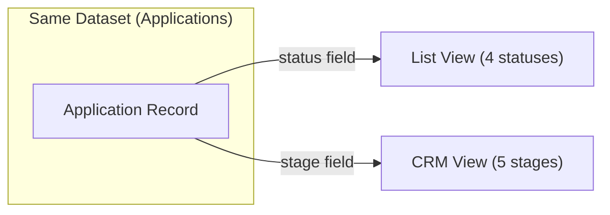

# CRM Application Card — Functional Specification

> **Version**: 1.0  
> **Date**: 2026-03-11  
> **Audience**: Product, Design, Engineering  
> **Language**: English

---

## 1. Module Overview

### What It Is

The **CRM Application Card** is the primary workspace for managing individual rental applications within the CRM pipeline. It consists of two interconnected elements:

- **Pipeline Card** — a compact summary card displayed within Kanban columns, providing at-a-glance information about the applicant, listing, and current status.
- **Detail Panel** — a slide-out side panel accessed by clicking a Pipeline Card, offering deep management capabilities through structured tabs: Overview, Notes, and Viewings.

### What Problem It Solves

- Gives property Owners a **centralized, structured view** of each application beyond simple accept/reject decisions.
- Enables **relationship management** by tracking notes, history, and property viewings within a single context.
- Provides **stage-aware tooling** (suggested note templates, rejection analysis) that guides the Owner through the deal lifecycle.
- Separates **quick triage** (List View) from **deal management** (CRM View) while operating on the same underlying dataset.

### Who Uses It

| Role | Interaction |
|------|------------|
| **Owner** | Views pipeline → Clicks card → Manages deal via Detail Panel tabs |
| **Tenant** | _No direct access_ — Tenant data is displayed but Tenants do not interact with the CRM view |

---

## 2. Core Terminology

| Term | Definition |
|------|-----------| 
| **Pipeline Card** | A compact card in the CRM Kanban column representing a single application. Displays tenant name, entity type, listing, timestamp, and status indicators. |
| **Detail Panel** | A slide-out side panel (520px wide) that appears when clicking a Pipeline Card. Contains a header, stage selector, and tabbed content area. |
| **CRM Stage** | The current position of an application within the deal pipeline (5 stages). Independent from the List View application status. |
| **Overview Tab** | Detail Panel tab showing listing info, metadata grid (type, stage, viewings count, notes count), and full history timeline. |
| **Notes Tab** | Detail Panel tab for free-text and template-based notes, with stage-aware suggested chips. |
| **Viewings Tab** | Detail Panel tab for scheduling and tracking property viewings (date, time, address, status). |
| **Suggested Note Chips** | Pre-written note templates that appear in the Notes tab, changing dynamically based on the current CRM stage. |
| **Rejection Stage Dropdown** | A special dropdown in the Notes tab (visible only in the "Rejected" stage) that records at which pipeline stage the rejection occurred. |
| **History Timeline** | A vertical timeline within the Overview tab showing all significant events (stage changes, notes added, viewings scheduled) with timestamps and color-coded dots. |
| **Viewing Status Badge** | A label on both the Pipeline Card and the Viewings tab indicating whether a viewing is "Upcoming" (Предстоит) or "Done" (Проведен). |

---

## 3. CRM Stage Model

### 3.1 Five-Stage Pipeline

| Stage | Key | Meaning | Column Color |
|-------|-----|---------|-------------|
| **New Application** | `new` | Just arrived, initial triage | `#F2994A` (orange) |
| **Initial Contact** | `contact` | Owner has reached out to the tenant | `#2F80ED` (blue) |
| **Viewings** | `viewing` | Property viewing scheduled or completed | `#9B59B6` (purple) |
| **Contract Closing** | `contract` | Negotiation / signing of tenant agreement | `#27AE60` (green) |
| **Rejected** | `rejected` | Deal fell through at any stage | `#E74C3C` (red) |

> [!NOTE]  
> CRM stages have **no hard transition restrictions** — any stage can be moved to any other stage via drag-and-drop or the stage dropdown in the Detail Panel. This is a deliberate design choice to give Owners maximum flexibility in pipeline management.

### 3.2 Stage Change Methods

| Method | Location | Description |
|--------|----------|-------------|
| **Drag-and-Drop** | Pipeline Kanban board | Drag a Pipeline Card from one column to another |
| **Stage Dropdown** | Detail Panel header | Select a new stage from the `<select>` dropdown |

**On every stage change:**
1. The `stage` field on the application record is updated.
2. A history entry is created with a timestamp and the transition description (e.g., `"Стадия: Новая заявка -> Первичный контакт"`).
3. The history entry receives the color of the **destination** stage.
4. The Pipeline board and Detail Panel body re-render immediately.

### 3.3 CRM Stage vs. List View Status (Independence)

> [!IMPORTANT]  
> The CRM `stage` and the List View `status` are **independent fields**. Changing the stage in CRM View does **not** change the status in List View, and vice versa. They represent different dimensions of the same application:
> - **Status** (List View): triage decision — Unread → Read → Accepted / Rejected
> - **Stage** (CRM View): relationship pipeline — New → Contact → Viewings → Contract → Rejected

---

## 4. Pipeline Card (Kanban Card)

### 4.1 Card Anatomy

Each Pipeline Card displays the following data in a compact layout:

| Element | Position | Data Displayed | Styling |
|---------|----------|---------------|---------|
| **Avatar** | Top-left | Tenant's initials (2 characters) | 32×32px circle, colored background per tenant |
| **Name** | Top, next to avatar | Full tenant name + verification badge (if verified) | 12px, font-weight 600 |
| **Entity Type** | Below name | "Физ. лицо" or "Юр. лицо" (abbreviated) | 10px, gray |
| **Listing Thumbnail** | Middle row | Property photo | 34×26px, rounded corners (4px) |
| **Listing Name** | Next to thumbnail | Property name (e.g., "Кв. 4Б, Здание 1") | 11px, font-weight 500 |
| **Viewing Badge** | Below listing (conditional) | "Предстоит" / "Проведен" | Colored badge: blue for upcoming, green for done |
| **Timestamp** | Bottom-left | Relative time (e.g., "2 часа назад") | 10px, light gray |
| **Message Indicator** | Bottom-right (conditional) | Chat icon + count | 10px, brand color (orange), bold |

### 4.2 Viewing Badge Logic

The Viewing Badge is **only shown** when:
1. The deal's current stage is `viewing`, **AND**
2. The deal has at least one viewing record.

| Condition | Badge | Color |
|-----------|-------|-------|
| Any viewing has `status: "upcoming"` | **Предстоит** | Blue (`#e3f2fd` bg, `#2F80ED` text) |
| All viewings have `status: "done"` | **Проведен** | Green (`#e8f5e9` bg, `#27AE60` text) |

### 4.3 Verification Badge

A small blue checkmark icon (SVG) appears next to the tenant's name if `verified: true`. This indicates the tenant has completed identity verification via OneID or E-imzo.

### 4.4 Card Interactions

| Interaction | Behavior |
|-------------|----------|
| **Click** | Opens the Detail Panel for this application |
| **Drag** | Initiates drag-and-drop to reorder or change CRM stage |
| **Hover** | Border changes to brand color; subtle shadow and upward translate (-1px) |
| **Dragging** | Card becomes semi-transparent (40% opacity) and slightly scaled down (97%) |

---

## 5. Detail Panel

### 5.1 Panel Structure

The Detail Panel is a **fixed-position side panel** (520px wide) that slides in from the right edge of the screen. It overlays the content area with a semi-transparent backdrop (`rgba(0,0,0,0.3)`).

| Component | Description |
|-----------|-------------|
| **Close Button** | Top-right `×` button (32×32px circle) |
| **Header** | Tenant avatar + name + entity type + Stage dropdown |
| **Tab Bar** | 4 tabs: Overview, ~~Messages~~, Notes, Viewings |
| **Body** | Scrollable content area that renders the active tab's content |

> [!NOTE]  
> The **Messages** tab is present in the tab bar but is **excluded from this specification**. It is documented separately.

### 5.2 Panel Header

| Element | Description |
|---------|-------------|
| **Avatar** | 48×48px circle with tenant initials, colored background |
| **Name** | Full tenant name, 18px, font-weight 700 |
| **Entity Type** | "Физическое лицо" or "Юридическое лицо" (full form), 13px, gray |
| **Stage Row** | Label "Стадия:" + `<select>` dropdown with all 5 stages; current stage is pre-selected |

### 5.3 Stage Dropdown Behavior

- Populated with all 5 CRM stages on panel open.
- The current stage is `selected` by default.
- **On change**: triggers `changeStageFromPanel()` which updates the stage, logs a history entry, and re-renders both the Pipeline board and the Detail Panel body.
- No restrictions — any stage can be selected from any other stage.

---

## 6. Overview Tab

The Overview tab provides a read-only summary of the application, divided into three sections:

### 6.1 Listing Section

| Element | Data |
|---------|------|
| **Thumbnail** | 64×48px property image, rounded corners (8px) |
| **Listing Name** | Property name (e.g., "Кв. 4Б, Здание 1") |
| **Submission Time** | "Заявка: {relative time}" (e.g., "Заявка: 2 часа назад") |

### 6.2 Metadata Grid

A 2×2 grid of key metrics, each in a card with gray background (`#f5f5f5`):

| Cell | Label | Value |
|------|-------|-------|
| **Type** | Тип | Entity type (Физическое лицо / Юридическое лицо) |
| **Stage** | Стадия | Current CRM stage label |
| **Viewings** | Просмотры | Count of viewing records |
| **Notes** | Заметки | Count of note records |

### 6.3 History Timeline

A vertical timeline showing all significant events in **reverse chronological order** (newest first):

| Element | Description |
|---------|-------------|
| **Timeline Line** | 2px vertical line, gray (`var(--gray-200)`), positioned left of entries |
| **Dot** | 12×12px colored circle, color corresponds to the related stage |
| **Timestamp** | 10px, light gray, above the event text |
| **Event Text** | 13px description with bold highlights for stage names |

**Events logged in history:**
- Stage creation (`"Новая заявка создана"`)
- Stage transitions (`"Стадия: Новая заявка -> Первичный контакт"`)
- Note additions (`"Добавлена заметка"`)
- Viewing scheduling (`"Просмотр назначен на 26.02 в 10:00"`)

---

## 7. Notes Tab

### 7.1 Layout Structure

The Notes tab is organized top-to-bottom:

1. **Existing Notes** (reverse chronological, newest first)
2. **Rejection Stage Dropdown** (conditional — only when stage is `rejected`)
3. **Note Input** (textarea)
4. **Suggested Note Chips** (stage-aware templates)
5. **Add Button** (full-width, dark background)

### 7.2 Note Card

Each note is displayed as a card with:

| Element | Description |
|---------|-------------|
| **Timestamp** | 10px, light gray (e.g., "Сегодня, 14:30") |
| **Edit Button** | Pencil icon — moves note text to the input field for editing, removes original |
| **Delete Button** | Trash icon — removes the note; hover state turns red |
| **Note Text** | 13px, gray, line-height 1.5 |

### 7.3 Note Actions

| Action | Description |
|--------|-------------|
| **Add Note** | Type text in textarea → Click "Добавить" → Note saved with current timestamp; history entry created |
| **Edit Note** | Click pencil icon → Note is removed from list → Text populates the textarea → User edits and re-adds |
| **Delete Note** | Click trash icon → Note is removed immediately; no confirmation dialog |

> [!NOTE]  
> Editing is implemented as a **delete + pre-populate** pattern: the original note is removed, its text is placed in the input field, and the user saves it as a new note. This means the original timestamp is lost.

### 7.4 Suggested Note Chips

Suggested Note Chips are **stage-aware pre-written templates** that appear below the text input. Clicking a chip instantly saves it as a new note.

| CRM Stage | Suggested Templates |
|-----------|-------------------|
| **Initial Contact** | "Клиент заинтересован, просит подробности" · "Клиент просит перезвонить позже" · "Клиент хочет назначить просмотр" · "Клиент сравнивает с другими вариантами" · "Клиенту не понравилось" |
| **Viewings** | "Просмотр только предстоит" · "Просмотр прошел успешно — клиенту всё понравилось" · "Просмотр прошел неуспешно — клиенту не понравилось" · "Клиент просит повторный просмотр" · "Клиенту не понравилось" |
| **Contract Closing** | "Договор отправлен клиенту на рассмотрение" · "Клиент подписал договор" · "Клиент просит изменить условия договора" · "Ожидается оплата залога" · "Клиенту не понравилось" |
| **Rejected** | "Клиенту не понравились условия" · "Клиенту не понравилась цена" · "Клиент выбрал другой вариант" · "Клиент передумал арендовать" · "Клиенту не понравилось" |

> [!NOTE]  
> The **New Application** stage has **no suggested chips**. Suggestions appear only from the "Initial Contact" stage onward.

### 7.5 Rejection Stage Dropdown

When the deal is in the **Rejected** (`rejected`) stage, a special dropdown appears above the note input:

| Property | Details |
|----------|---------|
| **Label** | "Этап отказа" (uppercase, 11px) |
| **Options** | Первичный контакт · Просмотры · Заключение контракта |
| **Default** | Placeholder "Выберите этап" (disabled, hidden) |
| **Purpose** | Records at which pipeline stage the rejection occurred, enabling analytics on bottlenecks |
| **Visibility** | Only visible when `stage === 'rejected'` |

The textarea placeholder also changes to **"Причина отказа..."** (instead of the default "Добавить заметку...") when in the Rejected stage.

---

## 8. Viewings Tab

### 8.1 Schedule Viewing Form

A compact form at the top of the Viewings tab:

| Field | Type | Description |
|-------|------|-------------|
| **Date** | `<input type="date">` | Viewing date |
| **Time** | `<input type="time">` | Viewing time |
| **Address** | `<input type="text">` | Pre-populated with the listing name; editable |
| **Submit Button** | Button | "Назначить" — dark background, white text |

**Validation:** All three fields (date, time, address) must be non-empty. If any field is empty, the form does nothing on submit.

**On submit:**
1. A viewing record is created with `status: "upcoming"`.
2. A history entry is logged: `"Просмотр назначен на {DD.MM} в {HH:MM}"`.
3. Both the Detail Panel body and the Pipeline board re-render (to update viewing badges on cards).

### 8.2 Viewing Card

Each viewing is displayed as a horizontal card:

| Element | Description |
|---------|-------------|
| **Date Box** | 48×48px white box with border; day number (16px bold) and abbreviated month (9px, uppercase) |
| **Time** | Viewing time, 13px bold |
| **Address** | Full address, 12px gray |
| **Status Badge** | Rounded badge: "Предстоит" (blue) or "Проведен" (green) |

### 8.3 Viewing Statuses

| Status | Key | Badge Color | Meaning |
|--------|-----|------------|---------|
| **Upcoming** | `upcoming` | Blue (`#e3f2fd` bg, `#2F80ED` text) | Viewing is scheduled but has not yet occurred |
| **Done** | `done` | Green (`#e8f5e9` bg, `#27AE60` text) | Viewing has been completed |

### 8.4 Empty State

When there are no viewings: centered message **"Нет просмотров"** (13px, gray, 20px padding).

---

## 9. Key Actions

### 9.1 Open Detail Panel

| Property | Details |
|----------|---------|
| **Who** | Owner |
| **Where** | Click any Pipeline Card in the CRM Kanban board |
| **Process** | 1. Active tab resets to "Overview" 2. Header populates with tenant info 3. Stage dropdown shows current stage 4. Overlay backdrop and panel slide in with animation (300ms cubic-bezier) |
| **Close** | Click `×` button, or click the overlay backdrop |

### 9.2 Change CRM Stage (Dropdown)

| Property | Details |
|----------|---------|
| **Who** | Owner |
| **Where** | Stage dropdown in Detail Panel header |
| **Process** | 1. Owner selects a new stage 2. Stage field updated on the application 3. History entry created with transition description 4. Pipeline board re-renders (card moves to new column) 5. Detail Panel body re-renders with updated data |
| **Restrictions** | None — any stage-to-stage transition is allowed |

### 9.3 Change CRM Stage (Drag-and-Drop)

| Property | Details |
|----------|---------|
| **Who** | Owner |
| **Where** | CRM Kanban board — drag card between columns |
| **Process** | 1. Owner drags a Pipeline Card from one column 2. Target column highlights with light orange background 3. On drop: stage updated, history entry created, board re-renders 4. If the Detail Panel is open for the dragged card, its body also re-renders |
| **Restrictions** | None — any stage-to-stage move is allowed |

### 9.4 Add Note

| Property | Details |
|----------|---------|
| **Who** | Owner |
| **Where** | Notes tab → textarea + "Добавить" button |
| **Process** | 1. Owner types note text (or clicks a Suggested Chip) 2. Clicks "Добавить" (or chip auto-saves) 3. Note saved with current timestamp 4. History entry: "Добавлена заметка" (blue dot) 5. Notes tab re-renders showing new note at top |
| **Validation** | Empty text is silently ignored |

### 9.5 Schedule Viewing

| Property | Details |
|----------|---------|
| **Who** | Owner |
| **Where** | Viewings tab → Schedule form |
| **Process** | 1. Owner fills date, time, and address 2. Clicks "Назначить" 3. Viewing created with `status: "upcoming"` 4. History entry: "Просмотр назначен на {date} в {time}" (blue dot) 5. Both Detail Panel and Pipeline board re-render |
| **Validation** | All three fields required; silently ignored if incomplete |

---

## 10. Business Rules & Edge Cases

### 10.1 CRM Stage Independence

| Rule | Description |
|------|-------------|
| **No auto-sync with List View** | Changing the CRM stage does **not** change the List View status, and vice versa. They are independent dimensions. |
| **Both fields coexist** | Every application has both a `status` (for List View) and a `stage` (for CRM View). |
| **CRM "Rejected" ≠ List "Rejected"** | CRM "Rejected" means the deal pipeline ended. List "Rejected" means the Owner declined the application. They may coincide but are not forced to sync. |

### 10.2 No Stage Transition Restrictions

| Rule | Description |
|------|-------------|
| **Any-to-any moves** | Unlike List View (which blocks moves to "New" and from final statuses), CRM stages have **no transition restrictions**. |
| **Reason** | The CRM pipeline is a flexible relationship management tool; restricting moves would reduce its utility. |
| **Backward moves allowed** | An Owner can move a deal from "Contract Closing" back to "Viewings" if a second viewing is needed. |

### 10.3 History Immutability

| Rule | Description |
|------|-------------|
| **Append-only** | History entries are only ever added, never removed or edited. |
| **Every stage change logged** | Both drag-and-drop and dropdown stage changes create history entries. |
| **Notes and viewings logged** | Adding a note or scheduling a viewing each create a history entry. |

### 10.4 Note Editing Behavior

| Rule | Description |
|------|-------------|
| **Edit = Delete + Re-add** | Editing a note removes the original and pre-fills the textarea. The original timestamp is lost; saving creates a new note with a new timestamp. |
| **No confirmation on delete** | Deleting a note is immediate — no confirmation dialog is shown. |

### 10.5 Viewing Status Lifecycle

| Rule | Description |
|------|-------------|
| **Newly created** | All viewings are created with `status: "upcoming"`. |
| **Status persists** | The current implementation does not automatically transition viewings from "upcoming" to "done" based on date. Status changes would require backend logic. |

### 10.6 Suggested Chips per Stage

| Rule | Description |
|------|-------------|
| **Stage-aware** | Chips change dynamically when the CRM stage changes. |
| **No chips for "New Application"** | The `new` stage has no suggested templates. |
| **One-click save** | Clicking a chip immediately saves it as a note — no confirmation step. |

### 10.7 Rejection-Specific Features

| Rule | Description |
|------|-------------|
| **Rejection Stage Dropdown** | Only visible when `stage === 'rejected'`; **mandatory** — the Owner must select the pipeline stage where the deal was lost before adding a rejection note. |
| **Placeholder change** | The note textarea placeholder changes to "Причина отказа..." in the Rejected stage. |
| **Analytics integration** | Rejection notes and stage data feed into the Analytics tab's bottleneck analysis and recommendation engine. |

### 10.8 Empty States

| Scenario | Behavior |
|----------|----------|
| No notes exist | Message: "Нет заметок" (centered, 13px gray) |
| No viewings exist | Message: "Нет просмотров" (centered, 13px gray) |
| No history entries | _(Unlikely — creation always logs an entry)_ Timeline section renders empty |

### 10.9 Panel Behavior

| Scenario | Behavior |
|----------|----------|
| Click overlay backdrop | Panel closes |
| Click `×` button | Panel closes |
| Stage changed while panel is open | Panel body re-renders with new data |
| Card dragged while its panel is open | Panel body re-renders with new stage |
| Panel opened for a different card | Previous card's panel state is replaced |

---

## 11. Resolved Decisions

The following items were discussed during the design process and resolved with the decisions documented below.

| # | Question | Decision |
|---|----------|----------|
| 1 | **Should CRM stages have transition restrictions like List View?** | **No — keep them unrestricted.** CRM is a flexible relationship management tool; hard restrictions reduce utility. The Owner should be able to move deals freely to match real-world deal flow. |
| 2 | **Should editing a note preserve the original timestamp?** | **No — current implementation replaces it.** Edit is implemented as delete + pre-fill + re-add. Timestamp preservation can be revisited if users find it confusing. |
| 3 | **Should viewing status auto-transition from "Upcoming" to "Done"?** | **Not for MVP.** Auto-transition requires backend scheduling logic. Manual status management or backend cron job can be added later. |
| 4 | **Should the Rejection Stage dropdown be mandatory?** | **Yes — it is mandatory.** The Owner must select the pipeline stage where the rejection occurred before adding a rejection note. This ensures accurate analytics on bottlenecks and conversion drop-off points. |
| 5 | **Are suggested note chips customizable by the Owner?** | **Not for MVP.** Chips are hardcoded per stage. User-defined templates can be added as a future feature. |
