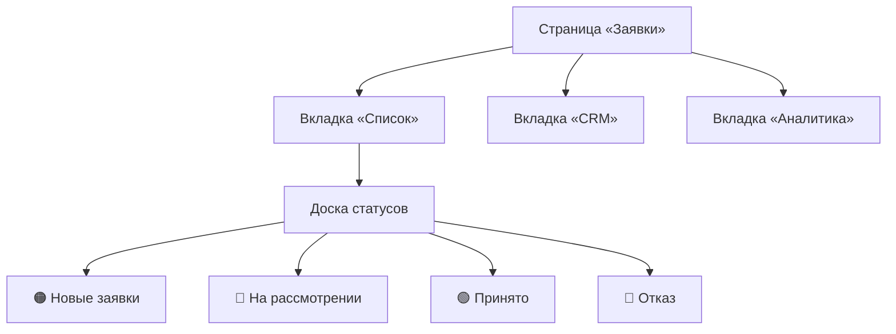
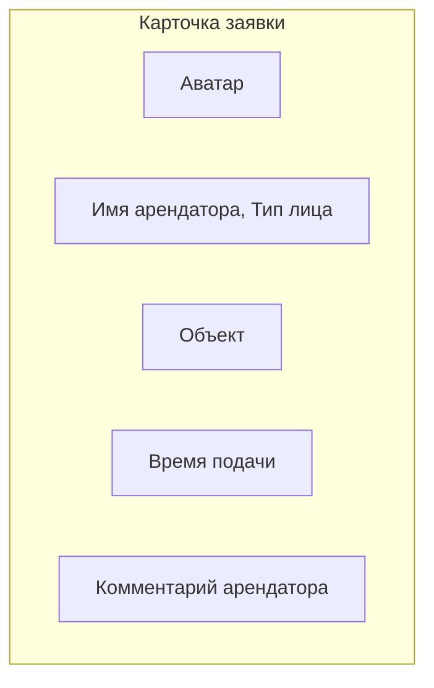
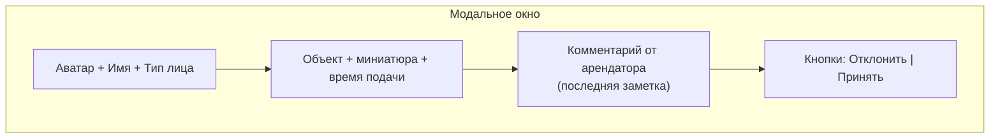
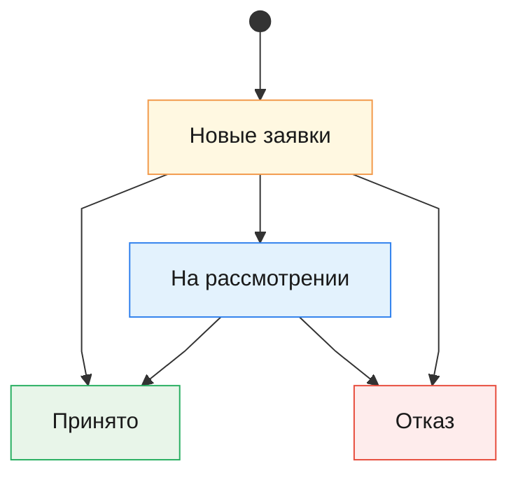

# Раздел «Список» — Документация

Раздел **«Список»** (вкладка "Список") — это основной интерфейс для просмотра и управления входящими заявками арендаторов. Заявки отображаются в виде **вертикальной доски статусов** с группировкой по текущему состоянию.

---

## Архитектура раздела

---

## Группы статусов

Каждая заявка принадлежит одной из четырёх групп. Группы отображаются как сворачиваемые секции:

| Группа | Ключ | Описание |
|--------|------|----------|
| **Новые заявки** | `unread` | Только что поступившие, ещё не просмотренные |
| **На рассмотрении** | `read` | Просмотрены владельцем, ожидают решения |
| **Принято** | `accepted` | Заявка одобрена |
| **Отказ** | `rejected` | Заявка отклонена |

---

## Карточка заявки

Каждая заявка отображается как горизонтальная карточка с ключевой информацией.

**Поля карточки:**
- **Аватар** — цветной круг с инициалами арендатора
- **Имя** — ФИО или название организации
- **Подстрока** — тип лица (Физ./Юр.) + последний комментарий арендатора (до 50 символов)
- **Объект** — миниатюра фото и название объекта
- **Время** — относительное время подачи заявки

---

## Модальное окно заявки

При клике на карточку открывается модальное окно с подробностями:

> [!IMPORTANT]
> Кнопки **«Отклонить»** и **«Принять»** **скрыты**, если заявка уже находится в группе «Принято» или «Отказ». Повторное изменение статуса через модалку невозможно.

---

## Фильтрация

Над доской расположены два выпадающих фильтра:

| Фильтр | Описание |
|--------|----------|
| **Статусы** | Фильтр по группе: Все / Не просмотрено / Просмотрено / Принято / Отказ |
| **Объекты** | Фильтр по объекту недвижимости (автоматически заполняется из данных) |

При активном фильтре — **пустые группы скрываются**. При сбросе (выбор «Все») показываются все группы.

---

## Жизненный цикл заявки

> [!NOTE]
> Заявки из группы «Новые заявки» также могут быть **сразу** перемещены в «Принято» или «Отказ» — через кнопки модального окна или drag-and-drop, минуя этап «На рассмотрении».

**Способы перехода между статусами:**

| Переход | Действие |
|---------|----------|
| Новые заявки → На рассмотрении | Drag-and-drop |
| Новые заявки → Принято | Кнопка «Принять» / Drag-and-drop |
| Новые заявки → Отказ | Кнопка «Отклонить» / Drag-and-drop |
| На рассмотрении → Принято | Кнопка «Принять» / Drag-and-drop |
| На рассмотрении → Отказ | Кнопка «Отклонить» / Drag-and-drop |

**Ограничения:**
- Заявку **нельзя вернуть** в группу «Новые заявки» из любой другой группы
- Заявки в статусах **«Принято»** и **«Отказ»** являются **финальными** — их нельзя переместить ни в какую другую группу
- Кнопки «Принять» / «Отклонить» **не отображаются** в модалке для заявок с финальными статусами «Принято» и «Отказ»
