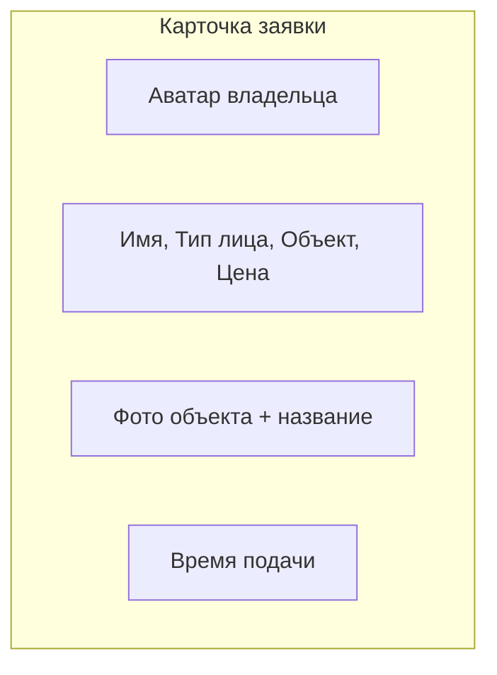
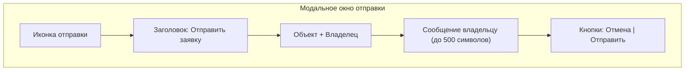
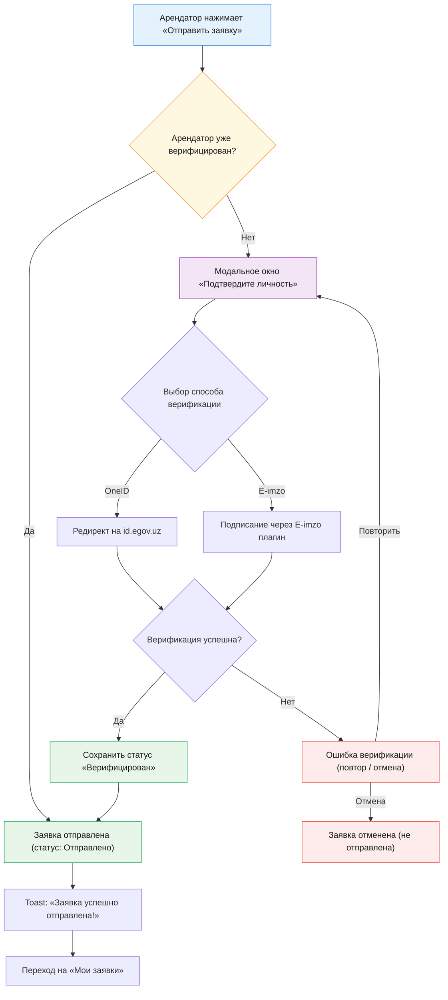
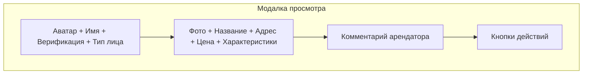
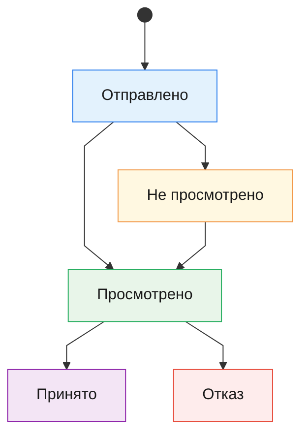

# Раздел «Мои заявки» (Tenant Side) — Документация

Раздел **«Мои заявки»** — это интерфейс арендатора для просмотра и управления **собственными** заявками на аренду. Страница содержит **список отправленных заявок** с фильтрацией, детализацией и возможностью отправки заявки.

---

## Экран «Мои заявки»

Список всех отправленных заявок арендатора, представленных горизонтальными карточками.

### Карточка заявки

**Поля карточки:**
- **Аватар** — цветной круг с инициалами владельца
- **Имя** — ФИО/название организации + значок верификации
- **Подстрока** — тип лица (Физ./Юр. лицо) · название объекта · цена
- **Фото объекта** — миниатюра + название
- **Время** — относительное время подачи заявки

---

## Статусы заявок

Каждая заявка имеет один из пяти статусов:

| Статус | Ключ | Описание |
|--------|------|----------|
| **Отправлено** | `sent` | Заявка отправлена, но ещё не просмотрена владельцем |
| **Не просмотрено** | `unread` | Заявка получена, но ещё не открыта владельцем |
| **Просмотрено** | `read` | Владелец просмотрел заявку |
| **Принято** | `invitation` | Владелец принял заявку |
| **Отказ** | `rejected` | Владелец отклонил заявку |

---

## Фильтрация

Над списком расположены два выпадающих фильтра:

| Фильтр | Описание |
|--------|----------|
| **Статусы** | Фильтр по статусу: Все / Отправлено / Не просмотрено / Просмотрено / Принято / Отказ |
| **Объекты** | Фильтр по объекту недвижимости (заполняется автоматически на основе данных заявок) |

При выборе «Все» фильтр сбрасывается. Если по фильтру нет заявок, отображается сообщение: *«Нет заявок по выбранным фильтрам»*.

---

## Модальное окно «Отправить заявку»

Открывается при нажатии кнопки **«Отправить заявку»** на экране объявления.

**Компоненты:**
- **Заголовок** — «Отправить заявку»
- **Подзаголовок** — название объекта · ФИО владельца
- **Поле ввода** — текстовое поле с placeholder и счётчиком символов (макс. 500)
- **Кнопки** — «Отмена» (закрытие) и «Отправить» (отправка заявки)

После успешной отправки:
1. Модальное окно закрывается
2. Система проверяет статус верификации арендатора (см. раздел ниже)
3. Если арендатор **верифицирован** — показывается **toast-уведомление**: *«Заявка успешно отправлена!»* и через 2 секунды — автоматический переход на экран «Мои заявки»
4. Если арендатор **не верифицирован** — открывается модальное окно верификации

---

## Верификация арендатора после отправки заявки

> [!IMPORTANT]
> После отправки заявки система **обязана** проверить, верифицирован ли арендатор. Если нет — арендатор должен пройти верификацию через **OneID** или **E-imzo** прежде чем заявка будет отправлена владельцу.

### Логика верификации

### Модальное окно «Подтвердите личность»

Открывается автоматически, если арендатор не прошёл верификацию ранее.

**Компоненты:**
- **Иконка** — щит/замок (символ безопасности)
- **Заголовок** — «Подтвердите личность»
- **Подзаголовок** — «Для отправки заявки необходимо пройти верификацию. Выберите способ:»
- **Кнопка OneID** — «Войти через OneID» (основной, синий)
- **Кнопка E-imzo** — «Подписать через E-imzo» (вторичный, outline)

### OneID — Процесс верификации

1. Система перенаправляет арендатора на `id.egov.uz` с параметрами
2. Арендатор авторизуется на OneID (логин/пароль или биометрия)
3. Арендатор подтверждает доступ к данным (scope: `openid`, `profile`, `pinfl`)
4. OneID возвращает `authorization_code` в callback URL
5. Бэкенд обменивает код на `access_token` + данные пользователя (PINFL, ФИО)
6. Система сохраняет статус **«Верифицирован»** + привязывает PINFL к профилю арендатора
7. Заявка автоматически отправляется владельцу

### E-imzo — Процесс верификации

1. Система вызывает плагин E-imzo в текущем окне
2. Арендатор выбирает ключ ЭЦП (USB-токен или файловый ключ)
3. Арендатор вводит PIN/пароль ключа
4. Система формирует пакет данных для подписи (ФИО, ИНН, timestamp)
5. E-imzo подписывает данные и возвращает подписанный пакет
6. Бэкенд верифицирует подпись через сервис проверки ЭЦП
7. Система сохраняет статус **«Верифицирован»** + привязывает ИНН к профилю
8. Заявка автоматически отправляется владельцу

### Бизнес-правила

1. **Однократная верификация** — после успешной верификации статус сохраняется навсегда. Все последующие заявки отправляются сразу без повторной верификации.
2. **Заявка не отправляется** до завершения верификации — в случае отмены или ошибки заявка **не создаётся** в системе.

---

## Модальное окно просмотра заявки

Открывается при клике на карточку заявки в списке.

**Секции модального окна:**

### 1. Шапка
- Аватар владельца (цветной круг с инициалами)
- ФИО / название организации
- Тип лица (Физическое / Юридическое)

### 2. Информация об объекте
- Фото объекта (крупная миниатюра)
- Название объекта
- Адрес
- Цена (сўм/мес)
- Характеристики: Общая площадь, Жилая, Этаж, Ремонт

### 3. Комментарий арендатора
- **Ваш комментарий** — текст отправленного комментария

### 4. Действия

Для всех статусов, кроме статуса «Отказ», доступна одна кнопка — **«Отменить заявку»**.

---

## Жизненный цикл заявки (со стороны арендатора)

> [!NOTE]
> Арендатор **не может** менять статус заявки напрямую. Статус изменяется на стороне владельца. Единственое доступное действие арендатора — **отменить** заявку.

---

## Навигация

При загрузке страницы отображается экран **«Мои заявки»** — список всех отправленных заявок.

---

## Общие UI-элементы

| Элемент | Описание |
|---------|----------|
| **Sidebar** | Боковая панель: Главная, Поиск, Избранное, **Мои заявки**, Договоры, Оплаты, Настройки |
| **Topbar** | Поисковая строка, уведомления, аватар пользователя |
| **Toast** | Всплывающее уведомление об успешной отправке заявки |
| **Модальные окна** | Закрываются по клику на крестик |
