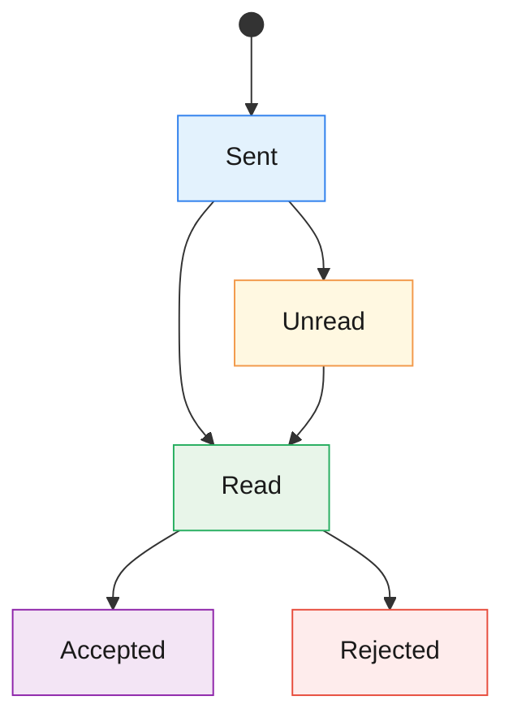
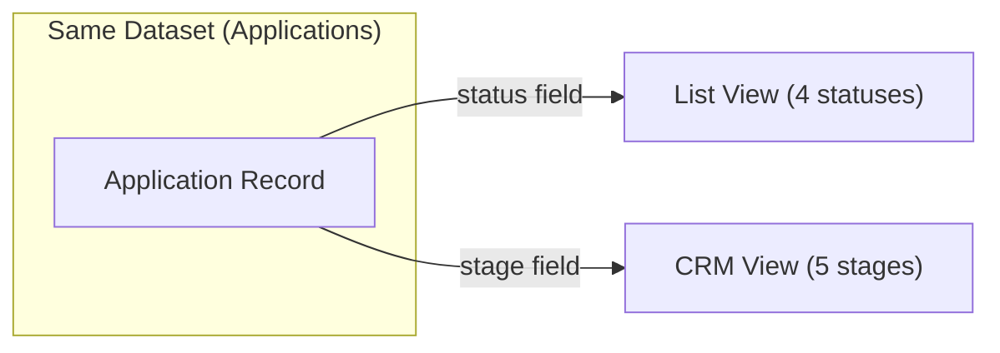

# Applications Module — Functional Specification

> **Version**: 1.0  
> **Date**: 2026-03-06  
> **Audience**: Product, Design, Engineering  
> **Language**: English

---

## 1. Module Overview

### What It Is

The **Applications** module is the core pipeline for managing rental inquiries on the Maydon platform. It connects two independent user roles — **Tenant** (applicant) and **Owner** (landlord) — through a structured request lifecycle.

### What Problem It Solves

- Provides tenants with a way to express interest in renting a property and track the status of their inquiry.
- Gives property owners a centralized workspace to receive, evaluate, and manage incoming applications across their listings.
- Eliminates ambiguity in the application process by enforcing a clear status model with defined transitions.

### How Each Role Uses It

| Role | Primary Use |
|------|-------------|
| **Tenant** | Browse listings → Send application → Track status → Cancel if needed |
| **Owner** | Receive applications → Review → Accept or Reject → Manage pipeline via CRM |

---

## 2. Core Terminology

| Term | Definition |
|------|-----------|
| **Application (Заявка)** | A formal rental inquiry sent by a Tenant to an Owner regarding a specific Listing. Contains a message and is subject to a status lifecycle. |
| **Owner (Владелец)** | A user who owns or manages property listings. The Owner receives and processes incoming applications. Also referred to as "Landlord". |
| **Tenant (Арендатор)** | A user seeking to rent a property. The Tenant sends applications and tracks their statuses. |
| **Listing (Объект / Объявление)** | A published property advertisement created by an Owner. Each Application is tied to exactly one Listing. |
| **Application Status** | The current state of an application within its lifecycle (e.g., Unread, Read, Accepted, Rejected). |
| **Final Status** | A status from which no further transition is allowed. In this module: **Accepted** and **Rejected** are final on the Owner side. |
| **List View (Список)** | Owner-side view mode: a vertical status board grouping applications by their current status. Used for triage and quick status changes. |
| **CRM View (CRM)** | Owner-side view mode: a horizontal Kanban pipeline grouping applications by deal stage. Used for deeper relationship management with built-in notes, messages, viewings, and history. |
| **Verification** | A mandatory one-time identity check (via OneID or E-imzo) that a Tenant must complete before their first application is delivered to an Owner. |

---

## 3. Status Model

### 3.1 Two Separate Status Systems

> [!IMPORTANT]  
> The module operates **two distinct status systems** that coexist on the Owner side:
> - **Application Status** — used in **List View** (triage-oriented, 4 statuses)
> - **CRM Stage** — used in **CRM View** (deal-pipeline-oriented, 5 stages)
> 
> These are independent data fields. An application has both a `status` (for List View) and a `stage` (for CRM View), and they change independently.

### 3.2 Tenant-Visible Statuses

Tenants see a **5-status model** reflecting the lifecycle from their perspective:

| Status | Key | Meaning | Triggered By | Final? |
|--------|-----|---------|-------------|--------|
| **Sent** | `sent` | Application submitted; waiting for system delivery to the Owner | System (on successful submit) | No |
| **Unread** | `unread` | Delivered to the Owner but not yet opened | System (automatic) | No |
| **Read** | `read` | Owner has viewed the application | Owner (opens application) | No |
| **Accepted** | `invitation` | Owner approved the application | Owner (clicks "Accept") | Yes |
| **Rejected** | `rejected` | Owner declined the application | Owner (clicks "Reject") | Yes |

> [!NOTE]  
> The Tenant **cannot change** the status of their application. Statuses are driven by Owner actions or system events. The only Tenant action affecting the lifecycle is **Cancel**.

#### Tenant-Side Status Flow

### 3.3 Owner-Side Application Statuses (List View)

In the List View, the Owner sees a **4-status model**:

| Status | Key | Label | Meaning | Final? |
|--------|-----|-------|---------|--------|
| **New** | `unread` | Новые заявки | Incoming, not yet processed | No |
| **Under Review** | `read` | На рассмотрении | Owner has seen and is evaluating | No |
| **Accepted** | `accepted` | Принято | Owner approved the application | Yes |
| **Rejected** | `rejected` | Отказ | Owner declined the application | Yes |

#### Owner-Side Status Transition Table (List View)

| From ↓ \ To → | New (unread) | Under Review (read) | Accepted | Rejected |
|----------------|:---:|:---:|:---:|:---:|
| **New (unread)** | — | ✅ Drag | ✅ Drag / Button | ✅ Drag / Button |
| **Under Review (read)** | ❌ Forbidden | — | ✅ Drag / Button | ✅ Drag / Button |
| **Accepted** | ❌ Forbidden | ❌ Forbidden | — | ❌ Forbidden |
| **Rejected** | ❌ Forbidden | ❌ Forbidden | ❌ Forbidden | — |

**Rules:**
1. No application can be moved **back** to "New" from any other status.
2. **Accepted** and **Rejected** are **final**: applications in these statuses cannot be moved to any other status.
3. Applications in final statuses are **not draggable**; their cards have no drag handle.

### 3.4 Owner-Side CRM Stages (CRM View)

The CRM View uses a **5-stage pipeline** independent of the List View statuses:

| Stage | Key | Meaning |
|-------|-----|---------|
| **New Application** | `new` | Just arrived, initial triage |
| **Initial Contact** | `contact` | Owner has reached out to the tenant |
| **Viewings** | `viewing` | Property viewing scheduled or completed |
| **Contract Closing** | `contract` | Negotiation / signing of tenant agreement |
| **Rejected** | `rejected` | Deal fell through at any stage |

> [!NOTE]  
> CRM stages have **no hard transition restrictions** — any stage can be moved to any other stage via drag-and-drop or the stage dropdown in the detail panel. This is a deliberate design choice to give Owners flexibility in pipeline management.

---

## 4. Key Actions

### 4.1 Tenant Actions

#### 4.1.1 Send Application

| Property | Details |
|----------|---------|
| **Who** | Tenant (authenticated) |
| **Where** | "Send Application" button on the Listing detail page |
| **Preconditions** | Listing must be active and published |
| **Process** | 1. Tenant clicks "Send Application" → Modal opens 2. Tenant writes a message (max 500 characters) 3. Tenant clicks "Submit" 4. **System checks verification status**: &nbsp;&nbsp;• **Verified** → Application created with status `sent` → Toast notification → Redirect to "My Applications" &nbsp;&nbsp;• **Not verified** → Verification modal opens (see §4.1.4) |
| **Result** | New application created; Owner sees it in their Applications module |
| **Status Change** | Application enters status `sent` |

#### 4.1.2 View Application

| Property | Details |
|----------|---------|
| **Who** | Tenant |
| **Where** | Click any application card in "My Applications" list |
| **Process** | Preview modal opens showing: Owner info, Listing details (photo, name, address, price, specs), Tenant's original message |
| **Status Change** | None |

#### 4.1.3 Cancel Application

| Property | Details |
|----------|---------|
| **Who** | Tenant |
| **Where** | "Cancel Application" button in the preview modal |
| **Preconditions** | Application status is **not** `rejected` |
| **Result** | Application is withdrawn/cancelled |
| **Status Change** | Application is removed or marked as cancelled |
| **Restriction** | The "Cancel" button is **hidden** when the status is `rejected` |

#### 4.1.4 Identity Verification (One-Time)

| Property | Details |
|----------|---------|
| **Who** | Tenant (not yet verified) |
| **Trigger** | Automatic — system launches verification after first application submission |
| **Methods** | **OneID** (redirect to id.egov.uz) or **E-imzo** (in-page digital signature plugin) |
| **On Success** | Verified status saved to tenant profile permanently; application automatically sent to Owner |
| **On Failure/Cancel** | Application is **not** created in the system; tenant returns to the listing page |
| **Business Rule** | Verification is **one-time** — once verified, all future applications skip this step |

### 4.2 Owner Actions

#### 4.2.1 View Application (List View)

| Property | Details |
|----------|---------|
| **Who** | Owner |
| **Where** | Click any application card on the status board |
| **Process** | Modal opens with: Tenant avatar & name, entity type (Individual/Legal), listing + thumbnail + submission time, last tenant note/message, action buttons |
| **Status Change** | If the application was `unread`, viewing it implicitly marks it as `read` |

#### 4.2.2 Accept Application

| Property | Details |
|----------|---------|
| **Who** | Owner |
| **Where** | "Accept" button in the application modal (List View) |
| **Preconditions** | Application status must not already be `accepted` or `rejected` |
| **Result** | Application moves to "Accepted" status group; action buttons are hidden on next open |
| **Status Change** | → `accepted` (Final) |
| **Tenant sees** | Status changes to "Accepted" (`invitation`) |

#### 4.2.3 Reject Application

| Property | Details |
|----------|---------|
| **Who** | Owner |
| **Where** | "Reject" button in the application modal (List View) |
| **Preconditions** | Application status must not already be `accepted` or `rejected` |
| **Result** | Application moves to "Rejected" status group; action buttons are hidden on next open |
| **Status Change** | → `rejected` (Final) |
| **Tenant sees** | Status changes to "Rejected" (`rejected`) |

#### 4.2.4 Move Between Statuses (Drag-and-Drop)

| Property | Details |
|----------|---------|
| **Who** | Owner |
| **Where** | List View — drag application card between status groups |
| **Allowed transitions** | See transition table in §3.3 |
| **Restrictions** | Cannot drag to "New"; cannot drag from "Accepted" or "Rejected" |

#### 4.2.5 Move Between CRM Stages

| Property | Details |
|----------|---------|
| **Who** | Owner |
| **Where** | CRM View — drag card between pipeline columns **or** use stage dropdown in detail panel |
| **Result** | Stage updated; history entry created with timestamp |
| **Restrictions** | No hard restrictions — any stage-to-stage move is allowed |

#### 4.2.6 CRM Detail Panel Actions

Available in the side panel when clicking a CRM card:

| Action | Tab | Description |
|--------|-----|-------------|
| **Change Stage** | Header | Dropdown to select a new CRM stage |
| **View Overview** | Overview | See listing info, metadata, and full history timeline |
| **View Messages** | Messages | Read the full conversation thread with the tenant; click "Reply" to navigate to messaging module |
| **Add/Edit/Delete Notes** | Notes | Free-text notes with stage-aware suggested templates |
| **Schedule Viewings** | Viewings | Add property viewings (date, time, address) with status tracking (Upcoming / Done) |

---

## 5. View Modes

### 5.1 List View (Список)

| Property | Details |
|----------|---------|
| **Purpose** | Quick decision-making on incoming applications |
| **Layout** | Vertical status board with collapsible groups: New → Under Review → Accepted → Rejected |
| **Data Source** | Application **status** field |
| **Key interactions** | Click card → Modal with Accept/Reject buttons; Drag-and-drop between status groups |
| **Available to** | Owner only |
| **Filtering** | By status, by listing |

### 5.2 CRM View (CRM)

| Property | Details |
|----------|---------|
| **Purpose** | Full relationship management: tracking each deal from first contact through contract closing |
| **Layout** | Horizontal Kanban board with 5 columns: New Application → Initial Contact → Viewings → Contract Closing → Rejected |
| **Data Source** | Application **stage** field (independent from status) |
| **Key interactions** | Click card → Side panel with 4 tabs (Overview, Messages, Notes, Viewings); Drag-and-drop between stages; Stage dropdown in panel |
| **Available to** | Owner only |
| **Filtering** | By stage (with sub-filters for viewing status: Upcoming / Done), by listing |

### 5.3 How List View and CRM View Relate

> [!IMPORTANT]  
> **List View** and **CRM View** operate on the **same underlying dataset** but use **different classification fields**:
> - List View reads/writes the `status` field (triage: Unread → Read → Accepted/Rejected).
> - CRM View reads/writes the `stage` field (pipeline: New → Contact → Viewings → Contract → Rejected).
> 
> Changing a status in List View **does not** automatically change the CRM stage, and vice versa. They are independent dimensions of the same application.

### 5.4 Tenant View

| Property | Details |
|----------|---------|
| **Purpose** | View and manage sent applications |
| **Layout** | Flat list of application cards with status badges |
| **Interactions** | Click card → Preview modal; Filter by status or listing; Cancel application from modal |
| **No sub-views** | Tenant see a single flat list only (no CRM, no Analytics) |

---

## 6. Restrictions & Edge Cases

### 6.1 Duplicate Applications

| Rule | Description |
|------|-------------|
| **One active application per listing** | A Tenant can only have **one active application** per Listing at any time. If an application already exists and is not in a final status (`accepted` or `rejected`), the "Send Application" button is disabled or hidden. |
| **Re-application after rejection** | If the Owner **rejects** an application, the Tenant is allowed to send a **new application** to the same Listing. |
| **Re-application after cancellation** | If the Tenant **cancels** their own application, they are allowed to send a **new application** to the same Listing. |
| **No re-application after acceptance** | If the Owner **accepts** an application, the Tenant **cannot** send another application to the same Listing. |

### 6.2 Cancellation Rules

| Scenario | Behavior |
|----------|----------|
| Tenant cancels application (status ≠ `rejected`) | "Cancel Application" button is available; application is withdrawn |
| Tenant tries to cancel a rejected application | "Cancel" button is **hidden**; no action possible |
| Owner cancels / withdraws an application | **Not supported** — Owners can only Accept or Reject |

### 6.3 Final Statuses (Irreversible)

| Status | Reversible? | Why |
|--------|------------|-----|
| **Accepted** (`accepted` / `invitation`) | No | Represents a commitment; triggers downstream processes (contract, etc.) |
| **Rejected** (`rejected`) | No | Represents a deliberate decision; Tenant is notified |

**Consequences:**
- Cards in final statuses are **not draggable** in List View.
- Accept/Reject buttons are **hidden** in the modal for applications in final statuses.
- In List View, dropping a card onto these groups from another final status is blocked.

### 6.4 Forbidden Transitions

| Transition | Blocked? | Mechanism |
|-----------|----------|-----------|
| Any status → New (unread) | ✅ Blocked | Drop is ignored |
| Accepted → Any other status | ✅ Blocked | Card is not draggable; buttons hidden |
| Rejected → Any other status | ✅ Blocked | Card is not draggable; buttons hidden |

### 6.5 Listing Deactivation

| Rule | Description |
|------|-------------|
| **Scope** | Only applications in **non-final** statuses (`sent`, `unread`, `read`) are affected. Applications already in `accepted` or `rejected` status **remain unchanged**. |
| **Automatic cancellation** | When a Listing is deactivated, all affected applications are **automatically cancelled**. Tenants and Owners can no longer interact with these applications. |
| **Tenant notification** | Tenants with cancelled applications receive a notification that the listing is no longer available. |
| **Reactivation restores applications** | If the Owner **reactivates** the Listing, previously cancelled applications are **restored** to the status they held before deactivation. |

### 6.6 Verification Edge Cases

| Scenario | Behavior |
|----------|----------|
| Verification fails (OneID / E-imzo) | Application is **not created**; tenant sees error with Retry / Cancel options |
| Tenant cancels verification | Application is **not created**; no data is saved |
| Already verified tenant | Submits immediately; no verification modal shown |
| Verification status persistence | Stored permanently on the tenant profile; applies to all future applications |

### 6.7 Empty States

| Scenario | Behavior |
|----------|----------|
| No applications match active filter | Message: "No applications matching selected filters" |
| Status group is empty (List View, **no filter** active) | Group still shown with header and count = 0. **Why:** the Owner sees the full pipeline structure at all times, so they know where cards can be dragged to. |
| Status group is empty (List View, **filter active**) | Group is **hidden entirely**. **Why:** when filtering, the Owner is focused on a specific data subset — empty groups add visual noise and are removed to keep the view clean. |

---

## 7. Open Questions

The following items require product/business decisions before final implementation:

| # | Question | Impact |
|---|----------|--------|
| 1 | **Should the CRM stage and List View status be linked?** For example, should moving a CRM stage to "Rejected" also set the List View status to "Rejected"? | Data consistency, UX expectations |
| 2 | **Can an Owner undo a Reject decision?** The current spec makes Rejected final. Should there be an appeal or reopen mechanism? | Status model, Tenant experience |
| 3 | **What happens after Accept?** Does accepting an application trigger a contract creation flow, a message to the tenant, or another module's action? | Cross-module integration |
| 4 | **Is there a notification system?** How are Tenants notified when their application status changes (push, email, in-app)? | Notification infrastructure |
| 5 | **What is the difference between Tenant "Sent" and "Unread" statuses?** Both represent pre-Owner-engagement states. Is "Sent" purely a frontend state before delivery, or does it persist in the backend? | API design, status model |
| 6 | **Can Owners archive old applications?** Is there a retention period or cleanup logic for applications in final statuses? | Data management, UI performance |
| 7 | **Is the CRM stage "Rejected" the same as the List View "Rejected"?** They use the same word but are independent fields. Should rejecting in CRM also reject in List View? | Consistency, business logic |

