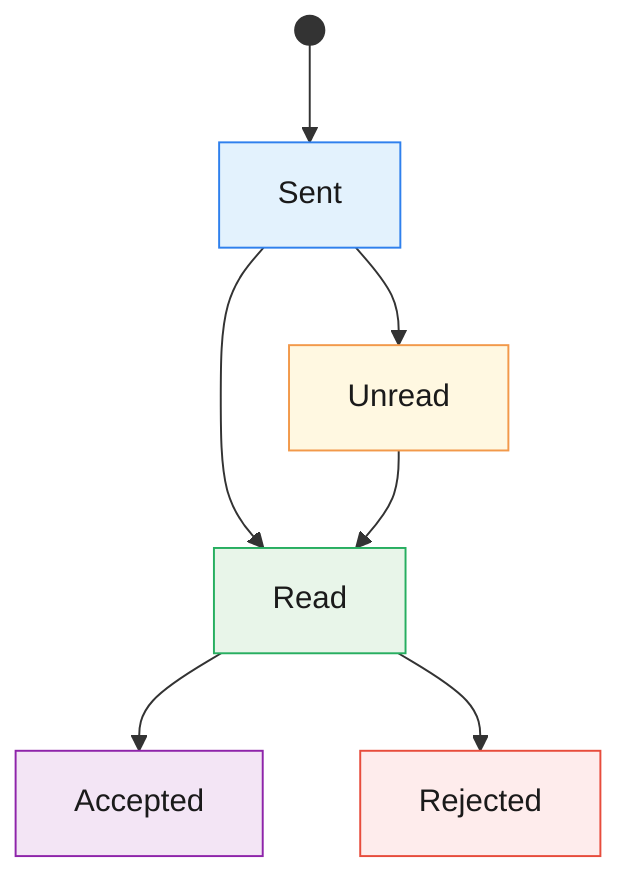
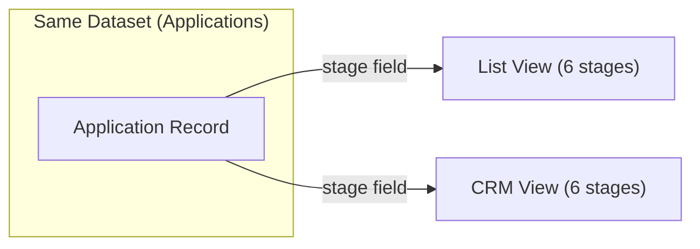

# Applications Module — Functional Specification

> **Version**: 2.0  
> **Date**: 2026-03-12  
> **Audience**: Product, Design, Engineering  
> **Language**: English

---

## 1. Module Overview

### What It Is

The **Applications** module is the core pipeline for managing rental inquiries on the Maydon platform. It connects two independent user roles — **Tenant** (applicant) and **Owner** (landlord) — through a structured request lifecycle.

### What Problem It Solves

- Provides tenants with a way to express interest in renting a property and track the status of their inquiry.
- Gives property owners a centralized workspace to receive, evaluate, and manage incoming applications across their listings.
- Eliminates ambiguity in the application process by enforcing a clear stage model with defined transitions.

### How Each Role Uses It

| Role | Primary Use |
|------|-------------|
| **Tenant** | Browse listings → Send application → Track status → Cancel if needed |
| **Owner** | Receive applications → Review → Accept or Reject → Manage pipeline via CRM |

---

## 2. Core Terminology

| Term | Definition |
|------|-----------| 
| **Application (Заявка)** | A formal rental inquiry sent by a Tenant to an Owner regarding a specific Listing. Contains a message and is subject to a stage lifecycle. |
| **Owner (Владелец)** | A user who owns or manages property listings. The Owner receives and processes incoming applications. Also referred to as "Landlord". |
| **Tenant (Арендатор)** | A user seeking to rent a property. The Tenant sends applications and tracks their statuses. |
| **Listing (Объект / Объявление)** | A published property advertisement created by an Owner. Each Application is tied to exactly one Listing. |
| **Stage (Стадия)** | The current position of an application within the unified 6-stage pipeline (e.g., New, Initial Contact, Viewings, Negotiation, Contract Closing, Rejected). |
| **Final Stage** | A stage from which no further transition is allowed. In this module: **Contract Closing** and **Rejected** are final on the Owner side. |
| **List View (Список)** | Owner-side view mode: a vertical status board grouping applications by their current stage. Used for triage and quick stage changes. |
| **CRM View (CRM)** | Owner-side view mode: a horizontal Kanban pipeline grouping applications by the same stage model. Used for deeper relationship management with built-in notes, viewings, and history. |
| **Verification** | A mandatory one-time identity check (via OneID or E-imzo) that a Tenant must complete before their first application is delivered to an Owner. |

---

## 3. Stage Model

### 3.1 Unified Stage System

> [!IMPORTANT]  
> The module operates a **single unified stage system** shared between **List View** and **CRM View**:
> - Both views read/write the same `stage` field on each application.
> - The 6-stage pipeline is: **Новые заявки → Первичный контакт → Просмотры → Переговоры → Заключение контракта → Отказ**.
> - Changing a stage in one view is immediately reflected in the other view.

### 3.2 Tenant-Visible Statuses

Tenants see a **5-status model** reflecting the lifecycle from their perspective:

| Status | Key | Meaning | Triggered By | Final? |
|--------|-----|---------|-------------|--------|
| **Sent** | `sent` | Application submitted; waiting for system delivery to the Owner | System (on successful submit) | No |
| **Unread** | `unread` | Delivered to the Owner but not yet opened | System (automatic) | No |
| **Read** | `read` | Owner has viewed the application | Owner (opens application) | No |
| **Accepted** | `invitation` | Owner approved the application | Owner (clicks "Accept") | Yes |
| **Rejected** | `rejected` | Owner declined the application | Owner (clicks "Reject") | Yes |

> [!NOTE]  
> The Tenant **cannot change** the status of their application. Statuses are driven by Owner actions or system events. The only Tenant action affecting the lifecycle is **Cancel**.

#### Tenant-Side Status Flow

### 3.3 Owner-Side Unified Stage Pipeline (List View & CRM View)

The Owner sees a **6-stage pipeline** used identically in both List View and CRM View:

| Stage | Key | Label (RU) | Dot Color | Meaning | Final? |
|-------|-----|------------|-----------|---------|--------|
| **New Applications** | `new` | Новые заявки | `#F2994A` | Incoming, not yet processed | No |
| **Initial Contact** | `contact` | Первичный контакт | `#2F80ED` | Owner has reached out to the tenant | No |
| **Viewings** | `viewing` | Просмотры | `#9B59B6` | Property viewing scheduled or completed | No |
| **Negotiation** | `negotiation` | Переговоры | `#17A2B8` | Active discussion of terms and conditions | No |
| **Contract Closing** | `contract` | Заключение контракта | `#27AE60` | Negotiation / signing of tenant agreement | Yes |
| **Rejected** | `rejected` | Отказ | `#E74C3C` | Deal fell through at any stage | Yes |

#### Owner-Side Stage Transition Table (List View)

| From ↓ \ To → | New | Initial Contact | Viewings | Negotiation | Contract Closing | Rejected |
|----------------|:---:|:---:|:---:|:---:|:---:|:---:|
| **New** | — | ✅ Drag | ✅ Drag | ✅ Drag | ✅ Drag | ✅ Drag |
| **Initial Contact** | ❌ Blocked | — | ✅ Drag | ✅ Drag | ✅ Drag | ✅ Drag |
| **Viewings** | ❌ Blocked | ✅ Drag | — | ✅ Drag | ✅ Drag | ✅ Drag |
| **Negotiation** | ❌ Blocked | ✅ Drag | ✅ Drag | — | ✅ Drag | ✅ Drag |
| **Contract Closing** | ❌ Blocked | ❌ Blocked | ❌ Blocked | ❌ Blocked | — | ❌ Blocked |
| **Rejected** | ❌ Blocked | ❌ Blocked | ❌ Blocked | ❌ Blocked | ❌ Blocked | — |

**Rules:**
1. No application can be moved **back** to "New" from any other stage.
2. **Contract Closing** and **Rejected** are **final**: applications in these stages cannot be moved to any other stage.
3. Applications in final stages are **not draggable**; their cards have no drag handle.
4. Non-final stages (except "New" as a target) allow free movement via drag-and-drop.

#### Owner-Side Stage Transitions (CRM View)

> [!NOTE]  
> CRM stages have **no hard transition restrictions** — any stage can be moved to any other stage via drag-and-drop or the stage dropdown in the detail panel. This is a deliberate design choice to give Owners flexibility in pipeline management.

---

## 4. Key Actions

### 4.1 Tenant Actions

#### 4.1.1 Send Application

| Property | Details |
|----------|---------|
| **Who** | Tenant (authenticated) |
| **Where** | "Send Application" button on the Listing detail page |
| **Preconditions** | Listing must be active and published |
| **Process** | 1. Tenant clicks "Send Application" → Modal opens 2. Tenant writes a message (max 500 characters) 3. Tenant clicks "Submit" 4. **System checks verification status**: &nbsp;&nbsp;• **Verified** → Application created with status `sent` → Toast notification → Redirect to "My Applications" &nbsp;&nbsp;• **Not verified** → Verification modal opens (see §4.1.4) |
| **Result** | New application created; Owner sees it in their Applications module |
| **Status Change** | Application enters status `sent` |

#### 4.1.2 View Application

| Property | Details |
|----------|---------|
| **Who** | Tenant |
| **Where** | Click any application card in "My Applications" list |
| **Process** | Preview modal opens showing: Owner info, Listing details (photo, name, address, price, specs), Tenant's original message |
| **Status Change** | None |

#### 4.1.3 Cancel Application

| Property | Details |
|----------|---------|
| **Who** | Tenant |
| **Where** | "Cancel Application" button in the preview modal |
| **Preconditions** | Application status is **not** `rejected` |
| **Result** | Application is withdrawn/cancelled |
| **Status Change** | Application is removed or marked as cancelled |
| **Restriction** | The "Cancel" button is **hidden** when the status is `rejected` |

#### 4.1.4 Identity Verification (One-Time)

| Property | Details |
|----------|---------|
| **Who** | Tenant (not yet verified) |
| **Trigger** | Automatic — system launches verification after first application submission |
| **Methods** | **OneID** (redirect to id.egov.uz) or **E-imzo** (in-page digital signature plugin) |
| **On Success** | Verified status saved to tenant profile permanently; application automatically sent to Owner |
| **On Failure/Cancel** | Application is **not** created in the system; tenant returns to the listing page |
| **Business Rule** | Verification is **one-time** — once verified, all future applications skip this step |

### 4.2 Owner Actions

#### 4.2.1 View Application (List View)

| Property | Details |
|----------|---------|
| **Who** | Owner |
| **Where** | Click any application card on the status board |
| **Process** | Modal opens with: Tenant avatar & name, entity type (Individual/Legal), listing + thumbnail + submission time, last tenant note/message, action buttons |
| **Status Change** | If the application was in `new` stage, viewing it implicitly marks it as seen |

#### 4.2.2 Accept Application

| Property | Details |
|----------|---------|
| **Who** | Owner |
| **Where** | "Принять" (Accept) button in the application modal (List View) |
| **Preconditions** | Application stage must not already be `contract` or `rejected` |
| **Result** | Application moves to "Заключение контракта" (Contract Closing) stage; action buttons are hidden on next open |
| **Stage Change** | → `contract` (Final) |
| **Tenant sees** | Status changes to "Accepted" (`invitation`) |

#### 4.2.3 Reject Application

| Property | Details |
|----------|---------|
| **Who** | Owner |
| **Where** | "Отклонить" (Reject) button in the application modal (List View) |
| **Preconditions** | Application stage must not already be `contract` or `rejected` |
| **Result** | Application moves to "Отказ" (Rejected) stage; action buttons are hidden on next open |
| **Stage Change** | → `rejected` (Final) |
| **Tenant sees** | Status changes to "Rejected" (`rejected`) |

#### 4.2.4 Move Between Stages (Drag-and-Drop — List View)

| Property | Details |
|----------|---------|
| **Who** | Owner |
| **Where** | List View — drag application card between stage groups |
| **Allowed transitions** | See transition table in §3.3 |
| **Restrictions** | Cannot drag to "New"; cannot drag from "Contract Closing" or "Rejected" |

#### 4.2.5 Move Between Stages (Drag-and-Drop — CRM View)

| Property | Details |
|----------|---------|
| **Who** | Owner |
| **Where** | CRM View — drag card between pipeline columns **or** use stage dropdown in detail panel |
| **Result** | Stage updated; history entry created with timestamp |
| **Restrictions** | No hard restrictions — any stage-to-stage move is allowed |

#### 4.2.6 CRM Detail Panel Actions

Available in the side panel when clicking a CRM card:

| Action | Tab | Description |
|--------|-----|-------------|
| **Change Stage** | Header | Dropdown to select a new stage (all 6 stages available) |
| **View Overview** | Overview | See listing info, metadata (entity type, current stage, viewings count, notes count), and full history timeline |
| **Add/Edit/Delete Notes** | Notes | Free-text notes with stage-aware suggested templates; rejection stage dropdown when deal is in "Rejected" stage |
| **Schedule Viewings** | Viewings | Add property viewings (date, time, address) with status tracking (Предстоит / Проведен) |

> [!NOTE]  
> The **Messages** tab has been removed from the CRM Detail Panel tabs. Messages are accessible via the main "Сообщения" module. The detail panel now has **3 tabs**: Overview, Notes, Viewings.

---

## 5. View Modes

### 5.1 List View (Список)

| Property | Details |
|----------|---------|
| **Purpose** | Quick decision-making on incoming applications |
| **Layout** | Vertical status board with collapsible groups: Новые заявки → Первичный контакт → Просмотры → Переговоры → Заключение контракта → Отказ |
| **Data Source** | Application **stage** field (unified with CRM View) |
| **Key interactions** | Click card → Modal with Accept/Reject buttons; Drag-and-drop between stage groups (with restrictions — see §3.3) |
| **Available to** | Owner only |
| **Filtering** | By stage (with sub-filters for viewing status: Предстоящие просмотры / Проведенные просмотры), by listing |

### 5.2 CRM View (CRM)

| Property | Details |
|----------|---------|
| **Purpose** | Full relationship management: tracking each deal from first contact through contract closing |
| **Layout** | Horizontal Kanban board with 6 columns: Новые заявки → Первичный контакт → Просмотры → Переговоры → Заключение контракта → Отказ |
| **Data Source** | Application **stage** field (unified with List View) |
| **Key interactions** | Click card → Side panel with 3 tabs (Overview, Notes, Viewings); Drag-and-drop between stages (no restrictions); Stage dropdown in panel |
| **Available to** | Owner only |
| **Filtering** | By stage (with sub-filters for viewing status: Предстоящие просмотры / Проведенные просмотры), by listing |

### 5.3 How List View and CRM View Relate

> [!IMPORTANT]  
> **List View** and **CRM View** operate on the **same underlying dataset** and use the **same stage field**:
> - Both views read/write the `stage` field.
> - Changing a stage in List View is immediately reflected in CRM View, and vice versa.
> - The difference is in **presentation** (vertical board vs. horizontal Kanban) and **interaction depth** (quick triage modal vs. full detail panel with notes, viewings, and history).
>
> **Drag-and-drop rules differ between views:**
> - **List View** enforces transition restrictions (no backward move to "New"; no moves from final stages).
> - **CRM View** allows unrestricted stage-to-stage movement for pipeline flexibility.

### 5.4 Tenant View

| Property | Details |
|----------|---------|
| **Purpose** | View and manage sent applications |
| **Layout** | Flat list of application cards with status badges |
| **Interactions** | Click card → Preview modal; Filter by status or listing; Cancel application from modal |
| **No sub-views** | Tenant see a single flat list only (no CRM, no Analytics) |

---

## 6. Restrictions & Edge Cases

### 6.1 Duplicate Applications

| Rule | Description |
|------|-------------|
| **One active application per listing** | A Tenant can only have **one active application** per Listing at any time. If an application already exists and is not in a final status (`contract` or `rejected`), the "Send Application" button is disabled or hidden. |
| **Re-application after rejection** | If the Owner **rejects** an application, the Tenant is allowed to send a **new application** to the same Listing. |
| **Re-application after cancellation** | If the Tenant **cancels** their own application, they are allowed to send a **new application** to the same Listing. |
| **No re-application after contract** | If the Owner moves an application to **Contract Closing**, the Tenant **cannot** send another application to the same Listing. |

### 6.2 Cancellation Rules

| Scenario | Behavior |
|----------|----------|
| Tenant cancels application (status ≠ `rejected`) | "Cancel Application" button is available; application is withdrawn |
| Tenant tries to cancel a rejected application | "Cancel" button is **hidden**; no action possible |
| Owner cancels / withdraws an application | **Not supported** — Owners can only Accept or Reject |

### 6.3 Final Stages (Irreversible)

| Stage | Reversible? | Why |
|-------|------------|-----|
| **Contract Closing** (`contract`) | No | Represents a commitment; triggers downstream processes (contract signing, move-in, etc.) |
| **Rejected** (`rejected`) | No | Represents a deliberate decision; Tenant is notified |

**Consequences:**
- Cards in final stages are **not draggable** in List View.
- Accept/Reject buttons are **hidden** in the modal for applications in final stages.
- In List View, dropping a card onto final stage groups from another final stage is blocked.
- In CRM View, cards in all stages remain draggable (no restrictions enforced).

### 6.4 Forbidden Transitions (List View)

| Transition | Blocked? | Mechanism |
|-----------|----------|-----------|
| Any stage → New (`new`) | ✅ Blocked | Drop is ignored |
| Contract Closing → Any other stage | ✅ Blocked | Card is not draggable; buttons hidden |
| Rejected → Any other stage | ✅ Blocked | Card is not draggable; buttons hidden |

### 6.5 Listing Deactivation

| Rule | Description |
|------|-------------|
| **Scope** | Only applications in **non-final** stages (`new`, `contact`, `viewing`, `negotiation`) are affected. Applications already in `contract` or `rejected` stage **remain unchanged**. |
| **Automatic cancellation** | When a Listing is deactivated, all affected applications are **automatically cancelled**. Tenants and Owners can no longer interact with these applications. |
| **Tenant notification** | Tenants with cancelled applications receive a notification that the listing is no longer available. |
| **Reactivation restores applications** | If the Owner **reactivates** the Listing, previously cancelled applications are **restored** to the stage they held before deactivation. |

### 6.6 Verification Edge Cases

| Scenario | Behavior |
|----------|----------|
| Verification fails (OneID / E-imzo) | Application is **not created**; tenant sees error with Retry / Cancel options |
| Tenant cancels verification | Application is **not created**; no data is saved |
| Already verified tenant | Submits immediately; no verification modal shown |
| Verification status persistence | Stored permanently on the tenant profile; applies to all future applications |

### 6.7 Empty States

| Scenario | Behavior |
|----------|----------|
| No applications match active filter | Message: "No applications matching selected filters" |
| Stage group is empty (List View, **no filter** active) | Group still shown with header and count = 0. **Why:** the Owner sees the full pipeline structure at all times, so they know where cards can be dragged to. |
| Stage group is empty (List View, **filter active**) | Group is **hidden entirely**. **Why:** when filtering, the Owner is focused on a specific data subset — empty groups add visual noise and are removed to keep the view clean. |

---

## 7. Resolved Decisions

The following items were originally open questions. They have been resolved with the decisions documented below.

| # | Question | Decision |
|---|----------|----------|
| 1 | **Should the CRM stage and List View status be linked?** | **Yes — they are now unified.** Both List View and CRM View use the same `stage` field with the same 6-stage pipeline. This eliminates confusion from having two independent classification systems. The difference between views is now purely presentational (vertical board vs. horizontal Kanban) and interactional (triage modal vs. full detail panel). |
| 2 | **Can an Owner undo a Reject decision?** | **No — Rejected remains final in List View.** In CRM View, unrestricted drag-and-drop is allowed for flexibility, but List View enforces finality. If the Owner made a mistake, the Tenant can re-apply (allowed per §6.1). |
| 3 | **What happens after Accept?** | **Stage changes to `contract` (Contract Closing).** The Owner uses CRM tabs (Notes, Viewings) to coordinate next steps manually. Contract creation and automated follow-ups can be added as a separate module later. |
| 4 | **Is there a notification system?** | **Yes — in-app notifications at minimum.** Tenants receive in-app notifications when their application status changes (Read, Accepted, Rejected). Push and email notifications can be added later. |
| 5 | **What is the difference between Tenant "Sent" and "Unread"?** | **"Sent" is a brief transitional state.** `sent` = application submitted but not yet delivered/processed. `unread` = delivered to the Owner's dashboard but not yet opened. The `sent` → `unread` transition is near-instant (backend processing). |
| 6 | **Can Owners archive old applications?** | **Not for MVP.** Applications in final stages remain in their groups. Filtering by listing is sufficient for managing volume. Archiving can be revisited if performance becomes an issue. |
| 7 | **Is the CRM "Rejected" the same as List View "Rejected"?** | **Yes — they are now the same.** With the unified stage model, there is a single `rejected` stage used in both views. Moving an application to "Отказ" in either view is reflected everywhere. |

---

## 8. Stage-Aware Features

### 8.1 Suggested Note Templates

Each stage provides context-aware suggested notes that the Owner can click to quickly add:

| Stage | Suggested Notes |
|-------|----------------|
| **Initial Contact** | "Клиент заинтересован, просит подробности", "Клиент просит перезвонить позже", "Клиент хочет назначить просмотр", "Клиент сравнивает с другими вариантами", "Клиенту не понравилось" |
| **Viewings** | "Просмотр только предстоит", "Просмотр прошел успешно", "Просмотр прошел неуспешно", "Клиент просит повторный просмотр", "Клиенту не понравилось" |
| **Negotiation** | "Обсуждаем цену и условия", "Клиент просит скидку", "Клиент согласен с условиями", "Клиент просит изменить сроки", "Клиент думает, обещал вернуться" |
| **Contract Closing** | "Договор отправлен клиенту на рассмотрение", "Клиент подписал договор", "Клиент просит изменить условия договора", "Ожидается оплата залога", "Клиенту не понравилось" |
| **Rejected** | "Клиенту не понравились условия", "Клиенту не понравилась цена", "Клиент выбрал другой вариант", "Клиент передумал арендовать", "Клиенту не понравилось" |

### 8.2 Rejection Stage Tracking

When an application is in the "Rejected" stage, the Notes tab includes an additional **"Этап отказа" (Rejection Stage)** dropdown. This allows the Owner to record at which pipeline stage the rejection occurred, with options: Первичный контакт, Просмотры, Переговоры, Заключение контракта.

### 8.3 Viewing Status Badge

For applications in the "Просмотры" (Viewings) stage, the CRM pipeline card displays a viewing status badge:
- **Предстоит** (Upcoming) — blue badge — at least one viewing has `upcoming` status
- **Проведен** (Done) — green badge — all viewings have `done` status

### 8.4 Analytics View

The **Analytics** tab provides data-driven insights across the pipeline:

| Component | Description |
|-----------|-------------|
| **Requests by Month** | Bar chart showing application volume over the last 6 months (Sep–Feb), with total count, current month count, and month-over-month change percentage |
| **Conversion Funnel** | Vertical stepped funnel showing progression: Новые заявки → Первичный контакт → Просмотры → Переговоры → Контракт, with drop-off percentages between stages |
| **Bottleneck Detection** | Identifies the stage transition with the highest loss percentage, along with the most common rejection reason |
| **Recommendation** | AI-generated text recommendation based on the top rejection reason pattern |
| **Object Filter** | Dropdown to filter all analytics data by specific listing |
